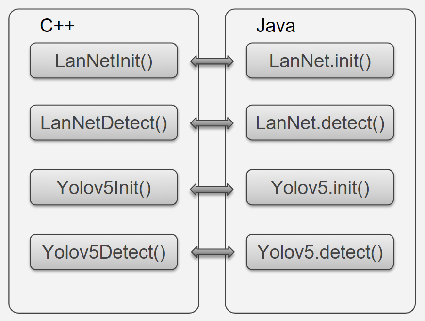

# Land Detection Android

专业方向综合项目

## 简介

本项目为同济大学软件工程专业方向综合课程的项目。项目最终实现了两套车道线检测与目标识别的模型落地，分别为Android移动端部署（依赖于移动端算力），与Web端部署（前后端分离架构，客户端负责交互与展示，客户端负责模型推理）。

仓库地址：

- Android端：[LinzhouLi/land-detection-android (github.com)](https://github.com/LinzhouLi/land-detection-android)
- Web服务端：[LinzhouLi/lane-detection-backend (github.com)](https://github.com/LinzhouLi/lane-detection-backend)
- Web客户端：[LinzhouLi/lane-detection-frontend (github.com)](https://github.com/LinzhouLi/lane-detection-frontend)

模型地址：

- 车道线检测模型：[Yolov5 (github.com)](https://github.com/ultralytics/yolov5)
- 目标检测模型：[Ultra-Fast-Lane-Detection: Ultra Fast Structure-aware Deep Lane Detection (ECCV 2020) (github.com)](https://github.com/cfzd/Ultra-Fast-Lane-Detection)

## Android

Yolov5模型模型通过腾讯前向推理框架[NCNN](https://github.com/Tencent/ncnn)部署在Android移动端。

模型转换流程：

Android端Java模型与C++模块调用示意图：

## Demo

测试平台：Android11，骁龙870

性能：每帧推理时间200ms左右（其中Yolov5n约30ms，Ultra Fast LaneNet约170ms）

实际驾车环境：

